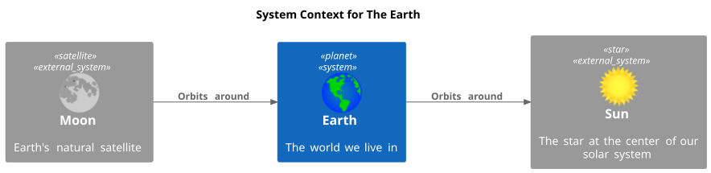
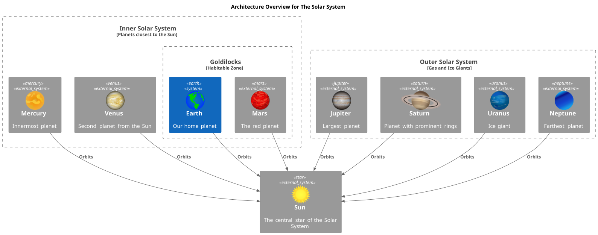
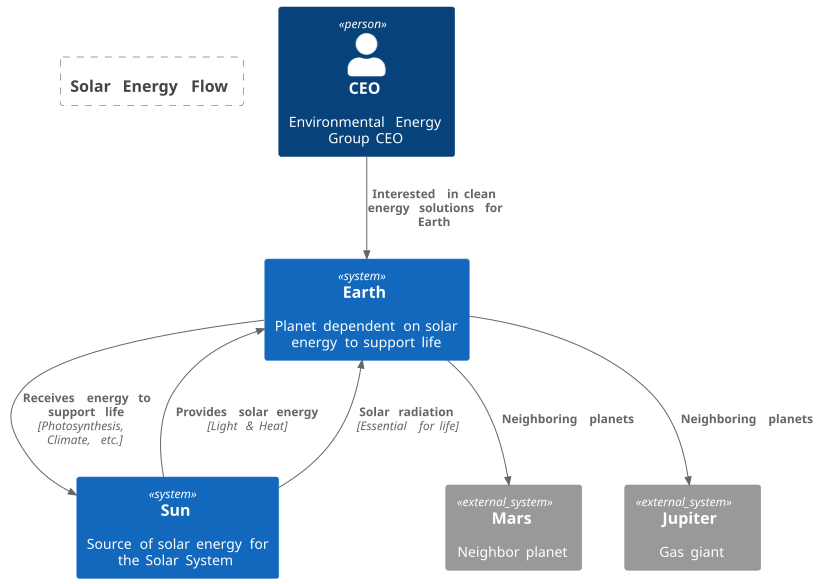
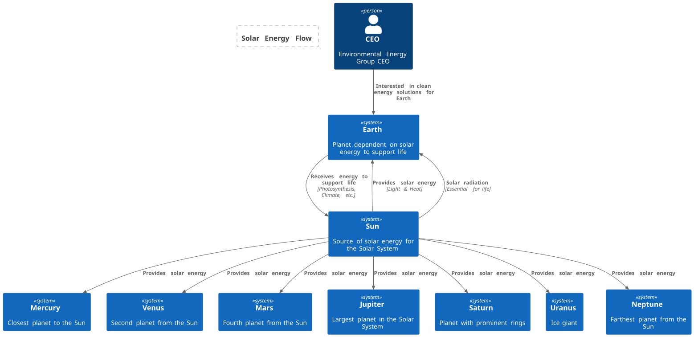

# Generative AI and the art of diagrams

## tags:

- art
- uml
- vibe
- modelling
- it architecture
- AI

## TL;DR

- Consistency in style and notation increases comprehension and reduces incorrect assumptions about the design
- Using novel notation enables greater expression at the risk of misinterpretation 
- Established notations (e.g. UML®) are not universally understood by most target audiences
- Either provide a style legend to guide the audience, or ensure all concepts are annotated in-line
- Generative AI also needs consistency in the prompt style to be consistent and predictable in its output.

## In the beginning...

> Using svg images from https://freesvg.org as sprites in a plantuml diagram, create a System context diagram using the c4-plantuml-stdlib notation depicting Planet Earth as the main system, and the relationships with the sun and the moon.



In the world of Information Technology, architecture diagrams are an essential means to communicate the intent of any system design. Today people attempt to communicate their intention to a Generative AI model, hoping that the resulting systhesised content meets their expections. 

As a Chemical Engineer I encountered standardised diagramming notations for various aspects of design, such as Process Flow Diagrams (PFD) and Piping & Instrumentation Diagrams (P&ID). The fundamental purpose of diagram standardisation is to faciliate a consistent and accurate means to express the author's intent and for learned audiences to be able interpret and realise the design. All such diagrams are essentially a type of model. They simplify the physical solution and convey specific detail needed to progress the project towards delivery.

As I trained to become an IT Architect I was introduced to the Unified Modelling Language® (UML®) which was strong on functional design, but was lacking in operational modelling (UML1). IBM at the time had developed the Architecture Description Language, which extended UML with a particular notation for operational and deployment modelling. UML2 has many extensions and enhancements over the original version that also provide features for expressing operational modelling. Despite being published as an open standard, UML has never became ubiquitous for many reasons including the steep learning curve and limited tooling. 

## Artistic or Structured?

IT Solution Architecture needed a more flexible and consumable approach. Architects and Systems Engineers have often adopted their own style of diagramming, sometimes incorporating elements of more formal methods in an informal way - the "Wild West" era of IT Architecture! The more abstract the level of design, the greater the variation of expression. The diagrams can become more artistic. This is particularly applicable to the `Architecture Overview` or `Architecture Summary` work product. The intention of the Architecture Overview is to convey the end to end big-picture view of the proposed IT solution, whilst high-lighting the architecturally significant elements or "systems". The notation and presentation style needs to be tailored to the intended audience (who often isn't an IT Architect). Artistry becomes a communication skill at this level. 

## Creating or generating the Architecture Overview

> In a similar manner, create a C4-PlantUML-stdlib diagram that represents the major features in the Solar System

> add to the diagram sprites and element tags that are more representative of each planet



The _Architecture Overview_ can incorporate business and technical elements. It might illustrate aspects of deployment and location (e.g. geographic regions), key business systems (e.g. Core Banking), architecturally significant technologies and constraints (e.g. a particular technology platform, cloud services provider, database or reference services). In some traditional methodologies, the difference in the presentation of these various "stereotypes" is quite limited, often using the same type of box with a stereotype label. A more artistic approach, introducing more colour, shape and even technology icons or characterisation can make the diagram and hence the discussion, more consumable.

Note that not every system in the enterprise needs to be represented, only those that either participate in the end to end business process (even if your solution impacts a section of it) or are shown to provide additional context. Every diagram is a "model" - a simplification of the physical realisation.

Typically this diagram majors on the _static_ view, identifying the significant elements and their associations to each other. There may be some aspect of the System Context incorporated, usually represented by people and external systems (i.e. actors in UML terms) positioned on the periphery of the diagram. Function and behaviour is usually not illustrated in an overview because that starts to clutter the visual appeal and include too much detail. The structure and behaviour of systems are represented in Component Models

System and enterprise boundaries are usually represented. Juduicious use of business iconography can help here to convey concepts that are likely to be recognised by the intended audience. It isn't uncommon to create multiple overview diagrams according to the specific audience.

## Method or Notation?

The _Architecture Overview_ is a work product in itself, as a part of a solution design methodology, but it isn't a method in it's own right. There is no industry or formal standard notation to express it. However it is recommended to be consistent with other equivalent work products in the environment you are working in. So if your business unit, company or customer has a standard taxonomy and notation for representing key concepts in the enterprise, start with those. 

In the examples show above, the C4 Model concepts are used, in conjunction with UML notation. C4 Model does not have an _Architecture Overview_ as part of it's methodology, but starts with a _System Context_. However, the Context diagram can be expanded to be the basis of an Overview.

## Vibe Diagramming?

We have established what should be in an _Architecture Overview_ and considerations for how to represent it. We just learnt that we can leverage existing methods and notations, perhaps by expanding a System Context, or reusing existing templates used in your environment. The question is, can Generative AI do this for you? This depends on your ability to express your intent clearly enough in a dialogue with the GenAI model.

By using a full complement of Prompt Engineering techniques, such as One-Shot or Few-Shot (providing one or more examples of the style),  Role Prompting, Contextual Prompting and refinement via rephrasing, adding constraints, or leveraging Chain-of-Thought prompting, Generative AI can give you a good start. However you will inevitably need to hand tune the content. Whilst different GenAI models are more optimised for generating images, an alternative approach is to direct the Model to create the resulting diagram as code in your preferred format. A good option is PlantUML, and the c4-plantuml-stdlib extension. This maximises the effectiveness of text based tokenisation. 

### Role Prompting

Express your role as a Technical Solution Architect or Enterprise Architect, and your target audience.

### Few-Shot Prompting

In tools such as Visual Studio Code with Co-pilot, you can provide reference documents as examples, documented taxonomies and reference architectures to constrain or direct the GenAI output.

### Contextual Prompting

Describe the objective of the diagram (what outcome is desired upon presenting it). You may also want to explain in what format you want the output. 

### Chain-of-Thought Prompting

Once you have some output that you feel is representative of your needs, you can refine the content with further requirements, additions, subtractions or constraints. However if you are not getting your desired output, you may need to apply chain-of-thought prompting, in which you instruct the GenAI model to break down the solution in to sub-steps or sections. This is more appropriate when trying to solution something rather than represent an existing solution.

Use of consistent notation in your prompts can generate predicatable elaborations based on best practices by referencing your preferred examples.


## Example: Generative AI Prompt Engineering for Architecture Overviews

See how this compares with the diagrams above. This prompt is more specific than the one used earlier

> As an Enteprise IT Architect, you need to present an Architecture Overview of the Solar Sytem, highlighting the dependency on the sun by the earth for energy to support life. Your audience is the CEO of an Environmental Energy Group looking to develop new solutions for clean energy generation. Use representative icons that are freely available through a creativecommons license to illustrate the concepts in the diagram. Generate the diagram using plantuml and the c4-plantuml-stdlib notatation.

```
@startuml SolarSystemOverview
!includeurl https://raw.githubusercontent.com/plantuml-stdlib/C4-PlantUML/master/C4_Context.puml

' Solar System Context
Person(ceo, "CEO", "Environmental Energy Group CEO")
System(sun, "Sun", "Source of solar energy for the Solar System")
System(earth, "Earth", "Planet dependent on solar energy to support life")
System_Ext(mars, "Mars", "Neighbor planet")
System_Ext(jupiter, "Jupiter", "Gas giant")

' Relationships
Rel(ceo, earth, "Interested in clean energy solutions for Earth")
Rel(sun, earth, "Provides solar energy", "Light & Heat")
Rel(earth, sun, "Receives energy to support life", "Photosynthesis, Climate, etc.")
Rel(earth, mars, "Neighboring planets")
Rel(earth, jupiter, "Neighboring planets")

' Highlight dependency
Boundary(solarEnergy, "Solar Energy Flow") {
    Rel(sun, earth, "Solar radiation", "Essential for life")
}

' Add icons (C4-PlantUML uses built-in icons)
UpdateElementStyle(sun, $bgColor="yellow", $fontColor="black")
UpdateElementStyle(earth, $bgColor="lightblue", $fontColor="black")
UpdateElementStyle(mars, $bgColor="red", $fontColor="white")
UpdateElementStyle(jupiter, $bgColor="orange", $fontColor="black")
SHOW_LEGEND()
@enduml
```



> extend the scope of the overview to include the other planets in the solar system

```
@startuml SolarSystemOverview_Extended
!includeurl https://raw.githubusercontent.com/plantuml-stdlib/C4-PlantUML/master/C4_Context.puml

Person(ceo, "CEO", "Environmental Energy Group CEO")
System(sun, "Sun", "Source of solar energy for the Solar System")
System(mercury, "Mercury", "Closest planet to the Sun")
System(venus, "Venus", "Second planet from the Sun")
System(earth, "Earth", "Planet dependent on solar energy to support life")
System(mars, "Mars", "Fourth planet from the Sun")
System(jupiter, "Jupiter", "Largest planet in the Solar System")
System(saturn, "Saturn", "Planet with prominent rings")
System(uranus, "Uranus", "Ice giant")
System(neptune, "Neptune", "Farthest planet from the Sun")

' Relationships
Rel(ceo, earth, "Interested in clean energy solutions for Earth")
Rel(sun, mercury, "Provides solar energy")
Rel(sun, venus, "Provides solar energy")
Rel(sun, earth, "Provides solar energy", "Light & Heat")
Rel(sun, mars, "Provides solar energy")
Rel(sun, jupiter, "Provides solar energy")
Rel(sun, saturn, "Provides solar energy")
Rel(sun, uranus, "Provides solar energy")
Rel(sun, neptune, "Provides solar energy")

Rel(earth, sun, "Receives energy to support life", "Photosynthesis, Climate, etc.")

' Highlight dependency
Boundary(solarEnergy, "Solar Energy Flow") {
    Rel(sun, earth, "Solar radiation", "Essential for life")
}

' Add icons/colors for planets
UpdateElementStyle(sun, $bgColor="yellow", $fontColor="black")
UpdateElementStyle(mercury, $bgColor="gray", $fontColor="black")
UpdateElementStyle(venus, $bgColor="gold", $fontColor="black")
UpdateElementStyle(earth, $bgColor="lightblue", $fontColor="black")
UpdateElementStyle(mars, $bgColor="red", $fontColor="white")
UpdateElementStyle(jupiter, $bgColor="orange", $fontColor="black")
UpdateElementStyle(saturn, $bgColor="khaki", $fontColor="black")
UpdateElementStyle(uranus, $bgColor="lightcyan", $fontColor="black")
UpdateElementStyle(neptune, $bgColor="blue", $fontColor="white")
SHOW_LEGEND()
@enduml
```




## Links:

  - [Unified Modelling Language®](https://www.omg.org/spec/UML/2.5.1/)
  - [C4 Model](https://c4model.com/)
  - [C4 PlantUML](https://github.com/plantuml-stdlib/C4-PlantUML/blob/master/README.md)
  - [PlantUML](https://plantuml.com/)

## Trademarks: 

  - Unified Modeling Language®, UML® are registered trademarks of the Object Management Group, Inc.
  - C4 Model is licensed under a Creative Commons Attribution 4.0 International License.
## Disclaimer

The postings on this profile are my own and do not necessarily represent my employer's positions, strategies or opinions.
